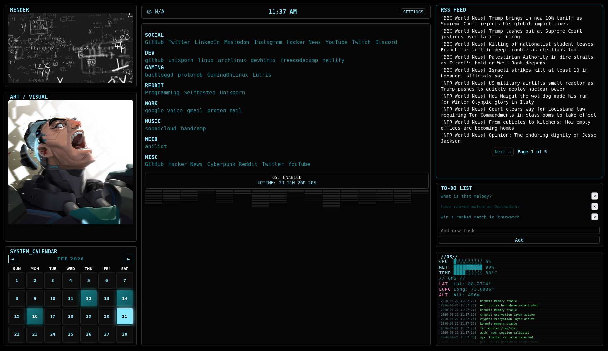

# Minimal Startpage

A lightweight, customizable browser startpage built with vanilla HTML, CSS, and JavaScript.




## Features

- Minimal and distraction-free layout
- Weather integration (OpenWeather API)
- Customizable links
- Responsive design
- No frameworks, fully static

---

## Setup

1. Clone the repository:

2. Open `script.js`

3. Add your OpenWeather API key:
```js
const WEATHER_API_KEY = 'YOUR_API_KEY';

free tier only for the API.

# Hosting

### Netlify
Drag and drop the project folder into Netlify or connect the repository for automatic deployments.
